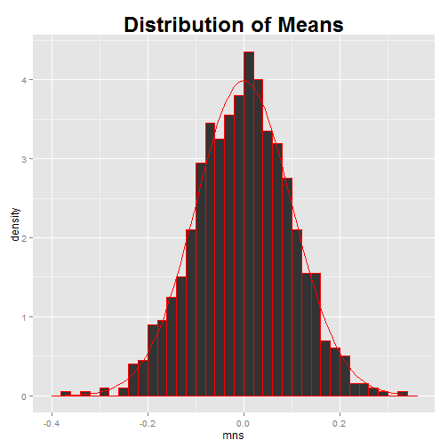

## Visualizing the Central Limit Theorem
This application enables the user to explore the 
<a href=http://en.wikipedia.org/wiki/Central_limit_theorem>Central Limit Theorem</a> 
as it applies to three distributions: -

*  The Normal distribution 
*  The Uniform distribution
*  The Exponential distribution.

The app prompts for the selection of an underlying distribution a radio button. Having done so a conditional panel will appear prompting for the secific parameters for this distribution (eg rate for Exponential etc.).

The app also prompts for: -
*  Sample Size - the size of an individual sample.
*  Number of Samples - the total number of samples the Means of which we will see obey the CLT.

---
## Processing

Having prompted for the parameters the application simulates the given distribution with random samples using the built-in R functions: rnorn, runif and rexp.

The display panel will show a histogram based on a Sample from the Underlying Distribution.

Below this will show a histogram of the Distibution of the Means. To demonstrate the CLT in operation the predicted Normal distribution is calculated and overlayed as a red line.

The server code makes use of shiny's reactive variable capability so that only the data which needs to be reprocessed is done so once an input parameter is changed.

---
## Example Output
Below we see sample output from the app showing the distribution of means of 1000 samples of size 100 from a normal distribution centred at 0 with a standard deviation of 1.

---

## Links

<a href="http://jph65.shinyapps.io/SHinyProject/">Application Link on shinyapps.io</a>

<a href="http://github.com/zjph90/DataProductsPrj">Github Repo for the Shiny Code</a>

<a href="http://en.wikipedia.org/wiki/Central_limit_theorem">Central Limit Theorem</a>

